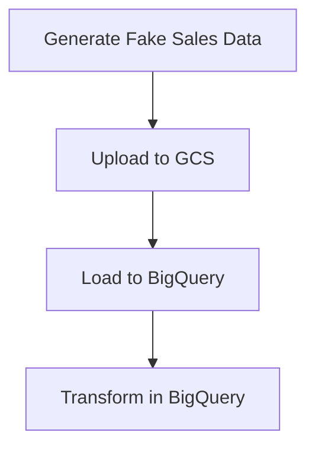
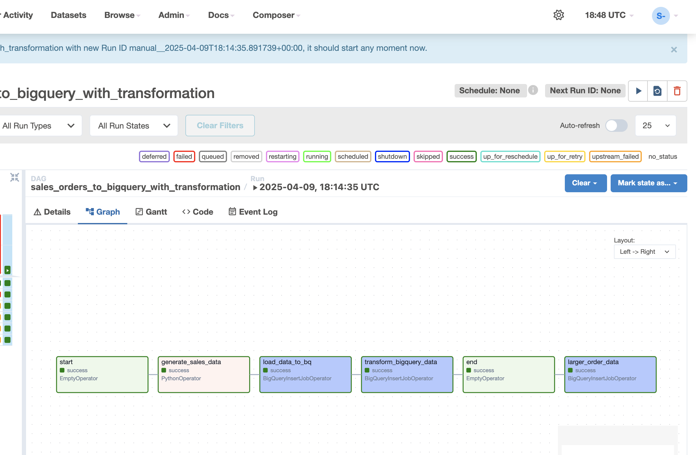
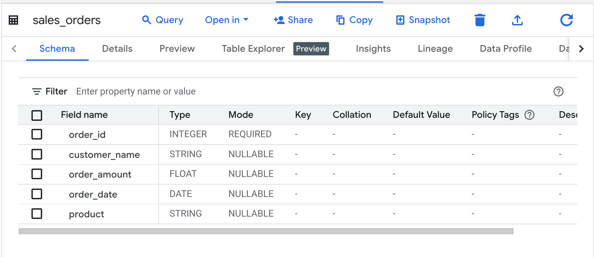
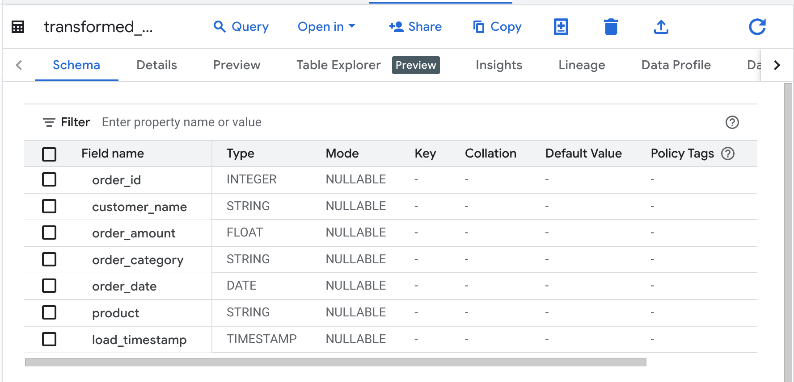

# GCP ELT Pipeline with Cloud Composer, BigQuery & GCS

This project demonstrates a simple but production-style ELT (Extract, Load, Transform) pipeline using Google Cloud Platform services like Cloud Composer (Airflow), BigQuery, and Cloud Storage.

## 🚀 Project Overview

- Generate fake sales data using Python and `Faker`
- Upload data to **Google Cloud Storage (GCS)**
- Load data from GCS into **BigQuery** using `BigQueryInsertJobOperator`
- Transform(categorize orders & select large orders amount ) data in BigQuery (SQL)
- Built with **Apache Airflow** in **Cloud Composer**

---

## 🧠 Why I Built This

As an aspiring Data Engineer, I created this to:

- Learn how to orchestrate pipelines using Airflow
- Practice working with GCP's Big Data stack
- Apply best practices in pipeline design, parameterization, and logging
- Build something I can showcase to recruiters and hiring managers

---

## 🧰 Tech Stack

| Tool | Purpose |
|------|---------|
| Cloud Composer | Managed Airflow orchestration |
| BigQuery | Data warehouse for analytics and transformation |
| GCS (Cloud Storage) | Landing zone for raw CSV data |
| Python + Faker | Generate synthetic sales data |
| Airflow Operators | BigQuery + GCS integrations |

---

## 🔁 Pipeline Flow



---

## 📁 Project Structure
```bash
    dags/
    └── gcp_elt_pipeline.py   
    README.md                 
```

---

## ⚙️ Configuration
This DAG pulls project variables from Airflow Variables. You can set them via Airflow UI or CLI:

- PROJECT_ID = GCP project where resources live
- BUCKET_NAME = Name of the bucket to store CSV data
- GCS_PATH = GCS path where the sales data will be stored as CSV
- BIGQUERY_DATASET = BigQuery dataset for staging and output tables
- BIGQUERY_TABLE = Table in BQ dataset that will store the raw sales data
- TRANSFORMED_TABLE = Table in BQ dataset where transformed data will be stored 

## ▶️ How to Run (in Composer)
1. Clone the repository 
```bash
    git clone https://.......
```
2. Create a Composer environment (here I choose the version 2 in small version). Be sure you enable the Composer Api and the corresponding IAM roles.
3. Upload the dag(gcp_etl_pipeline.py) in the DAGs folder created in GCS after the composer environment creation.
4. Set the Airflow Variables as mentioned above
5. Trigger the DAG manually via Airflow UI

## 📈 Example Output
Input: sales_orders.csv with fake data avalaible in GCS
Output:
    - sales_orders table in BigQuery (raw)
    - transformed_sales_orders table with order_category and load_timestamp
    - large_data with orders that have an amount >= 500

## 📸 Screenshots

### 🔄 Airflow DAG Overview



### 📊 Raw vs Transformed Data in BigQuery

**Raw Table:**



**Transformed Table:**




